# **Legal RAG Vietnamese Chatbot** 🏛️⚖️

A Retrieval-Augmented Generation (RAG) system designed to answer legal questions in Vietnamese, using hybrid retrieval, BGE reranking, and local Qwen generation over Vietnamese legal documents.

[](LICENSE)
[](https://python.org)


## **Features**

- **Hybrid RAG Architecture** - Combines Vietnamese dense embeddings, BM25 keyword search, and BGE cross-encoder reranking.
- **Raw Retrieval** - Uses the user's question directly; query refinement is disabled as real experiments proved against it.
- **Top-5 Evidence** - Retrieves 25 sparse and 25 dense candidates, deduplicates them, and selects five articles after reranking and score fusion.
- **Local Qwen Inference** - Generates answers through `langchain-ollama`, with `qwen3.5:9b` as the default model and no hosted inference API key required.
- **FastAPI + Gradio** - Serves questions through a validated HTTP API and a local chat interface with source excerpts.
- **Docker Deployment** - Packages the API, UI, and Qdrant with persistent indexes and a model cache; Ollama runs on the host.
- **Langfuse Cloud Tracing** - Optionally records retrieval, reranking, generation, model usage, errors, and conversation sessions.
- **Optional Web Fallback** - Available through the API; disabled by default and in Gradio.

## **Dataset**

The dataset is from [[Zalo-AI-2021] Legal Text Retrieval](https://www.kaggle.com/datasets/hariwh0/zaloai2021-legal-text-retrieval/data). Download and prepare it automatically:

```bash
python download_dataset.py
```

The download contains **3,271 legal documents**, **61,425 articles** (**61,068 with nonempty text**), **3,196 labeled training questions**, and **511 public-test questions**. The script prepares the layout below and writes `data/dataset_manifest.json` with counts and the source archive SHA-256. Dataset files, indexes, and raw results are excluded from Git.

```bash
├── data/
│   ├── train/
│   │   ├── train_question_answer.json
│   │   └── train_qna.csv
│   ├── test/
│   │   ├── public_test_question.json
│   │   └── public_test_sample_submission.json
│   ├── corpus/
│   │   ├── legal_corpus_legend.csv
│   │   ├── legal_corpus_splitted.csv
│   │   ├── legal_corpus_original.csv
│   │   ├── legal_corpus_merged_u369.csv
│   │   ├── legal_corpus_merged_u256.csv
│   │   ├── legal_corpus_hashmap.csv
│   │   └── legal_corpus.json
│   └── utils/
│       └── stopwords.txt
```
## **Architecture**

The system follows a RAG architecture with retrieval, reranking, and generation layers. Gradio calls FastAPI; the API loads models and existing indexes once at startup.

```mermaid
flowchart LR
    %% Input Layer
    Query["🔍 User Query<br/>Gradio / FastAPI"] ==> Guard["⚖️ Legal Domain Filter"]
    Guard ==> TP["⚙️ Original Query<br/>Text Processor"]

    %% Data Sources
    DOCS[("📚 Legal Documents<br/>Knowledge Base")] ==> TP

    %% Retrieval Layer
    subgraph retrieval["🔎 Retrieval Layer"]
        direction LR
        VS["🎯 Vector Store<br/>(Qdrant)<br/>Semantic Search"]
        BM25["📊 BM25 Retriever<br/>Keyword Search"]
        Hybrid["⚡ Hybrid Search<br/>Score Combination"]
        VS ==> Hybrid
        BM25 ==> Hybrid
    end

    %% Reranking Layer
    subgraph reranking["🏆 Reranking Layer"]
        direction LR
        RR["🧠 BGE v2-m3<br/>Cross-Encoder Reranker"]
        SF["🔢 Score Fusion<br/>Final Top-5"]
        RR ==> SF
    end

    %% Generation Layer
    subgraph generation["✨ Generation Layer"]
        direction LR
        CT["📋 Context Builder<br/>Prompt Assembly"]
        LLM["🤖 LLM<br/>(Ollama/Qwen)<br/>Response Generation"]
        CT ==> LLM
    end

    %% Main flow connections
    TP ==> VS
    TP ==> BM25
    Hybrid ==> RR
    SF ==> CT
    LLM ==> Response["📤 Final Response"]

    %% Fallback System
    SF -.->|"Optional API Fallback"| FB["🔄 Fallback Handler"]
    FB ==> GS["🌐 Web Search<br/>External Sources"]
    GS ==> CT

    %% External Data Stores
    VDB[("💾 Vector Database<br/>Embeddings Storage")] <==> VS
    BM25DB[("📇 BM25 Index<br/>Inverted Index")] <==> BM25

    %% Enhanced Styling
    classDef inputNode fill:#2d3748,stroke:#4299e1,stroke-width:3px,color:#ffffff,font-weight:bold
    classDef processNode fill:#1a365d,stroke:#63b3ed,stroke-width:2px,color:#ffffff
    classDef retrievalNode fill:#065f46,stroke:#10b981,stroke-width:2px,color:#ffffff
    classDef rerankNode fill:#7c2d12,stroke:#f97316,stroke-width:2px,color:#ffffff
    classDef generationNode fill:#581c87,stroke:#a855f7,stroke-width:2px,color:#ffffff
    classDef fallbackNode fill:#be123c,stroke:#f43f5e,stroke-width:2px,color:#ffffff
    classDef dataNode fill:#365314,stroke:#84cc16,stroke-width:2px,color:#ffffff
    classDef outputNode fill:#1e293b,stroke:#06b6d4,stroke-width:3px,color:#ffffff,font-weight:bold

    %% Apply styles
    class Query,Guard inputNode
    class TP processNode
    class VS,BM25,Hybrid retrievalNode
    class RR,SF rerankNode
    class CT,LLM generationNode
    class FB,GS fallbackNode
    class DOCS,VDB,BM25DB dataNode
    class Response outputNode

    %% Subgraph styling
    classDef subgraphStyle fill:#1e293b,stroke:#64748b,stroke-width:2px,color:#ffffff
    class retrieval,reranking,generation subgraphStyle
```



### Retrieval Layer

- **Vector Store (Qdrant)** - Cosine search using `bkai-foundation-models/vietnamese-bi-encoder` (768 dimensions).
- **BM25 Retriever** - Vietnamese text preprocessing and keyword matching, with `k1=1.2` and `b=0.65`.
- **Hybrid Search** - Gathers up to 25 candidates per retriever and merges them by article ID. Dense search uses a cosine threshold of 0.25.
- **Article-Level Indexing** - Stores one vector per nonempty article, retaining its title, full content, and legal metadata. The configured chunk size/overlap are not used by this indexing path.

### Reranking Layer

- **BGE Cross-Encoder** - Uses `BAAI/bge-reranker-v2-m3` to score query/article pairs.
- **Score Fusion** - Combines normalized retrieval and reranker scores with reranker weight 0.8, then selects **top-5** for answers.
- **Article Excerpts** - Limits title-plus-content reranking input and answer context to 1,000 characters per article, with an ellipsis when truncated. Full articles remain in the indexes.

### Generation Layer

- **LLM (Ollama/Qwen)** - Uses `langchain-ollama`; default model `qwen3.5:9b`, context 8,192 tokens, output cap 2,048 tokens, and thinking disabled. Override the model using `OLLAMA_MODEL` in `.env`.
- **Grounded Prompt** - Receives the original question and selected evidence, with instructions to cite supplied articles and acknowledge insufficient information.
- **Legal Domain Filter** - Remains active and may make a separate Ollama classification call. It does not rewrite the retrieval query.
- **Web Fallback** - Can be enabled per API request; Gradio keeps it disabled. Browser chat history is displayed, but only the current question is sent to the pipeline.

### Serving and Observability

- **FastAPI** - Exposes `/ask`, `/health`, and `/ready`. Validates questions, returns evidence excerpts and IDs, and processes one inference request at a time; overlapping requests receive HTTP 429.
- **Gradio** - Calls FastAPI without loading a second copy of the models or indexes.
- **Docker Compose** - Runs separate API, UI, and Qdrant containers. Embeddings and BGE run on CPU in the API container; host Ollama handles generation.
- **Langfuse Cloud** - Uses the Langfuse SDK and LangChain callback to trace classification, retrieval, reranking, and generation, including model names, timings, and Ollama token usage. Session IDs group browser conversations.

## **Results**

*Historical measurements from before the repository cleanup. Benchmark scripts, experiment notebooks, and reports have been removed from the current project; the core retrieval and generation behavior is unchanged.*

Evaluated on **all 3,196 labeled training questions** from Zalo AI 2021, searching **61,068 articles**. All methods use the original questions, exact gold article IDs, up to 25 candidates per enabled retriever, and **final top-5**. Scores are macro averages.

| Method | P@5 | R@5 | F1@5 | Hit@5 | MAP@5 | MRR@5 | nDCG@5 |
|--------|-----|-----|------|-------|-------|-------|--------|
| Sparse Only (BM25) | 0.1430 | 0.7020 | 0.2370 | 0.7093 | 0.5371 | 0.5429 | 0.5800 |
| Dense Only | 0.1210 | 0.5922 | 0.2004 | 0.6001 | 0.4489 | 0.4544 | 0.4862 |
| Hybrid (Sparse + Dense) | 0.1524 | 0.7476 | 0.2526 | 0.7547 | 0.5576 | 0.5633 | 0.6069 |
| **Hybrid + BGE Reranking** | **0.1681** | **0.8236** | **0.2785** | **0.8314** | **0.6715** | **0.6781** | **0.7113** |

Hybrid + BGE reaches **82.36% Recall@5**, improving over BM25 by **12.17 percentage points** and hybrid without BGE by **7.60 points**. nDCG@5 rises from **0.5800** for BM25 to **0.7113**. Hit@5 is the fraction of questions with at least one relevant article; MAP uses all unique gold articles as its denominator, and nDCG uses binary relevance.

| Method | Mean Retrieval (s) | P95 Retrieval (s) |
|--------|-------------------|------------------|
| Sparse Only (BM25) | 0.4205 | 0.9473 |
| Dense Only | 0.0219 | 0.0246 |
| Hybrid (Sparse + Dense) | 0.4423 | 0.9690 |
| Hybrid + BGE Reranking (inference included, dual-GPU ran)  | 2.7192 | 3.4635 |

*Timings come from Kaggle runs. The BGE baseline used two concurrent T4 workers, while the ablations shared searches in a single query-embedding worker.*

The Qwen 3.5 9B full run also completed **3,196 answers**, averaging **15.91 seconds** for generation with **zero output-cap hits**. Qwen generates answers after retrieval and does not determine these retrieval scores.

*These are training-set retrieval measurements, not held-out performance or generated-answer accuracy. Citation faithfulness and answer quality still require review. The former upstream table used different cutoffs and a different reranker, so it is not a matched baseline for the gains above.*

See the archived [ablation comparison and verification](https://github.com/doremonn2847/Legal-RAG-VN-Chatbot/blob/0951fd2d501e594956dca44dd55620f72e43e237/docs/ablation-results-review.md) and [full Qwen run review](https://github.com/doremonn2847/Legal-RAG-VN-Chatbot/blob/0951fd2d501e594956dca44dd55620f72e43e237/docs/qwen-full-run-review.md) for protocols, source/index checks, per-question regressions, and limitations.

## **Installation**

### 1. Prepare the environment

Clone this repository and create a Python 3.11 environment:

```bash
git clone https://github.com/doremonn2847/Legal-RAG-VN-Chatbot.git
cd Legal-RAG-VN-Chatbot
python -m venv .venv
# Windows PowerShell: .\.venv\Scripts\Activate.ps1
# Linux/macOS: source .venv/bin/activate
pip install -r requirements.txt
```

Install [Ollama](https://ollama.com/download) and [Docker Desktop](https://www.docker.com/products/docker-desktop/), then start both. Copy `.env.example` to `.env` and download the generation model:

```bash
ollama pull qwen3.5:9b
```

Use these settings for native scripts with the local Docker Qdrant server:

```dotenv
OLLAMA_BASE_URL=http://localhost:11434
OLLAMA_MODEL=qwen3.5:9b
QDRANT_PATH=
QDRANT_URL=
QDRANT_API_KEY=
API_BASE_URL=http://127.0.0.1:8000
```

Leave the three Qdrant settings empty to use `localhost:6333`. No inference API key is required. To use a different model, pull it with Ollama, change `OLLAMA_MODEL`, and restart the API. The full Qwen benchmark used `qwen3.5:9b`; its answer-generation measurements do not apply to other models.

### 2. Download the dataset and build indexes

From the repository root, with the virtual environment activated:

```bash
python download_dataset.py
docker compose up -d qdrant
python setup_system.py
```

`setup_system.py` is the indexing entry point. It builds the article-level vector collection and `index/bm25_index.pkl`, or loads existing complete indexes. Vector insertion uses stable article IDs, embedding batches of 16, and write batches of 128; an interrupted vector build skips already indexed articles on rerun. A BM25 build is saved after completion. The full corpus can take hours on CPU; use the GPU route below for the initial embeddings.

To deliberately replace both indexes after changing article content or the embedding model:

```bash
python setup_system.py --rebuild
```

**`--rebuild` recreates the vector collection and rebuilds BM25.** Stop the API/UI first and retain an index backup if needed. Model downloads happen on first use. Normal API startup loads existing indexes and never rebuilds them.

#### GPU indexing on Colab

1. Open [colab_indexing.ipynb](notebooks/colab_indexing.ipynb) in Colab, or select a Colab GPU kernel in VS Code. Select a GPU runtime and run the cells in order. The notebook contains a source snapshot, downloads the dataset, embeds the full corpus, checks BGE, and exports `colab_vector_index.zip`; no inference API key is needed.
2. Download the ZIP to the local project. Stop any process using the embedded index, then import and transfer it to the Qdrant server:

```bash
python import_vector_index.py colab_vector_index.zip
docker compose up -d qdrant
python upload_vector_index.py
python setup_system.py
```

The importer validates the embedding model, dataset manifest, dimensions, and vector count, and backs up an existing `index/qdrant`. The transfer copies vectors and metadata to the server without re-embedding; it can be rerun after interruption. The final setup command builds or loads the separate BM25 index and reuses the populated server collection. Keep `QDRANT_PATH` empty for these server-based setup commands.

Regenerate the notebook's verified source snapshot after code changes with `python tools/create_colab_notebook.py`. The notebook restores this snapshot directly, without cloning the former upstream repository.

Qdrant persists server data in `index/qdrant-server`; keep the portable `index/qdrant` and ZIP as backups. Local embedded Qdrant is intended for portable indexing/export and allows only one process to open its directory at a time. Use the server for the full-corpus application.

### 3. Launch the application

#### Docker Compose

After the vector collection, BM25 index, and stopwords are prepared:

```bash
docker compose up -d --build
docker compose ps
```

- **Chat UI:** [http://127.0.0.1:7860](http://127.0.0.1:7860/)
- **API documentation:** [http://127.0.0.1:8000/docs](http://127.0.0.1:8000/docs)
- **Readiness:** [http://127.0.0.1:8000/ready](http://127.0.0.1:8000/ready)

Ollama stays on the host; Compose connects through `host.docker.internal:11434`. The API container performs embeddings and BGE reranking on CPU. The first build/startup downloads dependencies and model weights; a persistent `model-cache` volume retains the weights. CPU reranking and generation can be slow on a laptop. Stop native services already using ports 8000/7860 before starting the containers.

```bash
docker compose logs -f api
docker compose stop ui api
```

See [Docker and Langfuse setup](docs/docker-langfuse.md) for host Ollama connectivity, storage, and troubleshooting.

#### Native FastAPI and Gradio

With Qdrant and Ollama running, start FastAPI:

```bash
python -m uvicorn api:app --host 127.0.0.1 --port 8000 --workers 1
```

In a second terminal with the same environment activated:

```bash
python app.py
```

Gradio sends requests to FastAPI; both are required. Use one API worker to avoid duplicating the models. See [API setup and endpoints](docs/api.md) for request/response details, readiness, and errors.

### 4. Enable Langfuse Cloud tracing (optional)

Create a Langfuse Cloud project and add its credentials to the private `.env`:

```dotenv
LANGFUSE_TRACING_ENABLED=true
LANGFUSE_PUBLIC_KEY=pk-lf-your-project-key
LANGFUSE_SECRET_KEY=sk-lf-your-project-key
LANGFUSE_BASE_URL=https://cloud.langfuse.com
LANGFUSE_CAPTURE_CONTENT=true
```

Use the URL for your project region: EU `https://cloud.langfuse.com`, US `https://us.cloud.langfuse.com`, or Japan `https://jp.cloud.langfuse.com`. Restart the native API or recreate the Docker services:

```bash
docker compose up -d --build api ui
```

Traces include questions, answers, retrieved article IDs/scores, nested pipeline stages, timings, and Ollama token usage. Common emails, Vietnamese phone numbers, 12-digit IDs, and Langfuse keys are masked during export; this is not complete anonymization. Set `LANGFUSE_CAPTURE_CONTENT=false` to redact observation inputs/outputs. Tracing is disabled by default, and telemetry failures do not block inference.

See [Langfuse setup and tracing behavior](docs/docker-langfuse.md) and its [live trace audit instructions](docs/docker-langfuse.md#audit-a-live-trace). Local Ollama token usage reflects context consumption, not hosted-provider spending.

### 5. Run checks

Run offline checks with tracing disabled so test requests are not sent to your Cloud project. Use UTF-8 output for Vietnamese text and console symbols:

```powershell
# Windows PowerShell
$env:LANGFUSE_TRACING_ENABLED='false'
$env:PYTHONIOENCODING='utf-8'
python -m unittest discover -s tests -v
```

```bash
# Linux/macOS
LANGFUSE_TRACING_ENABLED=false PYTHONIOENCODING=utf-8 python -m unittest discover -s tests -v
```

The offline suite uses test doubles and does not require model downloads or live credentials. The current application suite contains **61 tests** covering retrieval, query routing, dataset/index handling, API/UI behavior, and telemetry. Tests specific to the removed benchmark tooling are no longer included. Live model quality and citation faithfulness require separate review.

## **References**

[1] T. N. Ba, V. D. The, T. P. Quang, and T. T. Van. Vietnamese legal information retrieval in question-answering system, 2024. URL https://arxiv.org/abs/2409.13699.

[2] P. Lewis, E. Perez, A. Piktus, F. Petroni, V. Karpukhin, N. Goyal, H.Küttler, M. Lewis, W. tau Yih, T. Rocktäschel, S. Riedel, and D. Kiela. Retrieval-augmented generation for knowledge-intensive nlp tasks, 2021. URL https://arxiv.org/abs/2005.11401.

[3] Y. Gao, Y. Xiong, X. Gao, K. Jia, J. Pan, Y. Bi, Y. Dai, J. Sun, M. Wang, and H. Wang. Retrieval-augmented generation for large language models: A survey, 2024. URL https://arxiv.org/abs/2312.10997.

[4] J. Rayo, R. de la Rosa, and M. Garrido. A hybrid approach to information retrieval and answer generation for regulatory texts, 2025. URL https://arxiv.org/abs/2502.16767.

[5] [BM25 retriever](https://python.langchain.com/docs/integrations/retrievers/bm25/)

[6] [QDrant Vector Database](https://qdrant.tech/documentation/)
## **License**

This project is licensed under the [MIT License](LICENSE).
